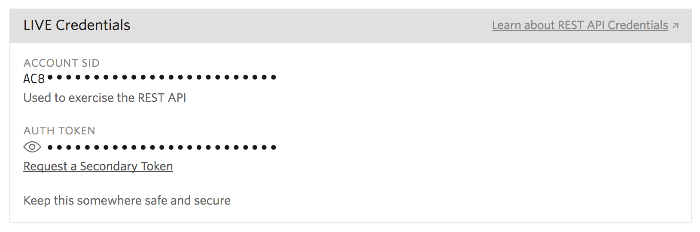
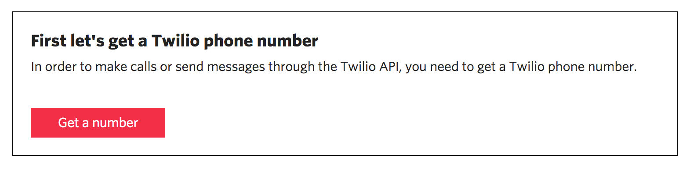
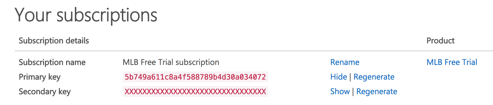

[](https://travis-ci.org/IBM/tjbot-sports-buddy)

# Build a TJBot using Watson Services to talk about sports

*Read this in other languages: [한국어](README-ko.md).*

In this developer journey we will build a TJBot that knows baseball. Using Watson Discovery, TJBot will give you insight about your favorite teams, such as their current league standing, their upcoming shedule, and links to a few relevant articles from Watson News.

When the reader has completed this journey, they will understand how to:

* Build a TJBot that converses using Watson Conversation
* Use Watson Text to Speech and Speech to Text services to converse with TJBot
* Use Watson Tone Analyzer to determine your sentiment about your favorite teams
* Use Watson Discovery News to find news articles about your favorite teams
* Query 3rd party data sources to get the latest Major League Baseball (MLB) data
* Use Twilio to send SMS text messages with team schedules and news article links


### With Watson

Want to take your Watson app to the next level? Looking to leverage Watson Brand assets? Join the [With Watson](https://www.ibm.com/watson/with-watson) program which provides exclusive brand, marketing, and tech resources to amplify and accelerate your Watson embedded commercial solution.

## Included components

* [Watson Conversation](https://www.ibm.com/watson/developercloud/conversation.html): Build, test and deploy a bot or virtual agent across mobile devices, messaging platforms, or even on a physical robot.
* [Watson Discovery](https://www.ibm.com/watson/developercloud/discovery.html): A cognitive search and content analytics engine for applications to identify patterns, trends, and actionable insights.
* [Watson Text to Speech](https://www.ibm.com/watson/developercloud/text-to-speech.html): Converts written text into natural sounding audio in a variety of languages and voices.
* [Watson Speech to Text](https://www.ibm.com/watson/developercloud/speech-to-text.html): A service that converts human voice into written text.
* [Watson Tone Analyzer](https://www.ibm.com/watson/developercloud/tone-analyzer.html): Uses linguistic analysis to detect communication tones in written text.

## Featured technologies

* [Twilio](https://www.twilio.com/): Integrate voice, messaging, and VoIP into your web and mobile apps.
* [MLB Fantasy Data](https://fantasydata.com/): A leading provider of real time sports data and content across multiple sports, serving fantasy, media and mobile clients worldwide.
* [Node.js](https://nodejs.org/en/): An asynchronous event driven JavaScript runtime, designed to build scalable applications.

# Watch the Video

[](https://www.youtube.com/watch?v=NJ87_rYfH0c)

# Steps

This app is designed to be run on a TJBot, but it can work on any standard workstation or laptop that supports audio controls - specifically a microphone input device and an output speaker. It may be simplier to first get this working on your laptop. If you would like to go directly to building this on a TJBot, jump to the section entitled [Build a TJBot](#build-a-tjbot) before completing the following steps.

1. [Clone the repo](#1-clone-the-repo)
2. [Create IBM Cloud services](#2-create-bluemix-services)
3. [Configure Watson Conversation](#3-configure-watson-conversation)
4. [Enable Watson Discovery](#4-enable-watson-discovery)
5. [Enable Watson Speech to Text](#5-enable-watson-speech-to-text)
6. [Enable Watson Text to Speech](#6-enable-watson-text-to-speech)
7. [Enable Watson Tone Analyzer](#7-enable-watson-tone-analyzer)
8. [Register for Twilio Service](#8-register-for-twilio-service)
9. [Register for MLB Fantasy Data Service](#9-register-for-mlb-fantasy-data-service)
10. [Run the application](#10-run-the-application)

## 1. Clone the repo

Clone the `tjbot-sports-buddy` locally. In a terminal, run:

  `$ git clone https://github.com/ibm/tjbot-sports-buddy`

We’ll be using the file [`data/workspace.json`](data/workspace.json)

## 2. Create IBM Cloud services

Create the following services:

  * [**Watson Conversation**](https://console.ng.bluemix.net/catalog/services/conversation)
  * [**Watson Discovery**](https://console.ng.bluemix.net/catalog/services/discovery)
  * [**Watson Text to Speech**](https://console.ng.bluemix.net/catalog/services/text-to-speech/)
  * [**Watson Speech to Text**](https://console.ng.bluemix.net/catalog/services/speech-to-text/)
  * [**Watson Tone Analyzer**](https://console.ng.bluemix.net/catalog/services/tone-analyzer/)


## 3. Configure Watson Conversation

Launch the **Watson Conversation** tool. Use the **import** icon button on the right

<p align="center">
  
</p>

Find the local version of [`data/workspace.json`](data/workspace.json) and select **Import**. Find the **Workspace ID** by clicking on the context menu of the new workspace and select **View details**. Save this ID for later.

<p align="center">
  
</p>

*Optionally*, to view the conversation dialog select the workspace and choose the **Dialog** tab, here's a snippet of the dialog:


## 4. Enable Watson Discovery

Launch the **Watson Discovery** tool. Select the **Watson Discovery News Collection**.

<p align="center">
  
</p>

From the details panel, save the **environment_id** and **collection_id** values.

<p align="center">
  
</p>

## 5. Enable Watson Speech to Text

Select the **Watson Speech to Text** service. Select the **Service credentials** menu item.


Click **View Credentials** and save the **username** and **password** values.

## 6. Enable Watson Text to Speech

Select the **Watson Text to Speech** service. Select the **Service credentials** menu item.


Click **View Credentials** and save the **username** and **password** values.

## 7. Enable Watson Tone Analyzer

Select the **Watson Tone Analyzer** service. Select the **Service credentials** menu item.


Click **View Credentials** and save the **username** and **password** values.

## 8. Register for Twilio Service

One of the main functions of the `tjbot-sports-buddy` is to text upcoming games and news headlines about the users favorite baseball teams. To send SMS text messages, we use the Twilio service. Register for a free trial account at [https://www.twilio.com/try-twilio](https://www.twilio.com/try-twilio).

As part of the service, you will be assigned the following values, which you will need to save, they are accessible through your user account settings:

- Account SID
- Authentication Token



Lastly, you will need a Twilio supplied phone number, where all texts will originate from. To create one, navigate to the *Programmable SMS* option in the context menu.



- Twilio supplied phone number

By default, you will only be able to send SMS text messages to the phone number you provided to create your account. To send messages to other numbers, you need to add them at [https://www.twilio.com/console](https://www.twilio.com/). For each number you enter, the user of the number will be asked to verify and then be sent a verification code. You will then need to enter this verification code to complete the registration process.

> **NOTE:** with a trail account, you may not be able to text to phone numbers with an area code that is different than the one used for your Twilio supplied number.  

## 9. Register for MLB Fantasy Data Service

Another feature of the `tjbot-sports-buddy` is being able to provide up to the minute Major League Baseball (MLB) stats. Specifically, schedules and standings. To retrieve this data, we use APIs supplied by FantasyData.

Register for a free trial accoount at [https://developer.fantasydata.com](https://developer.fantasydata.com).

Once registered, save the supplied subscription key, available through your profile.



## 10. Run the application

First, update the values in [`config.new.js`](config.new.js) and rename it to `config.js`:

```
$ cp config.new.js config.js
### edit config.js
```

Second, install dependencies, run the following from the cloned repo location:

```
$ npm install --save
```

> **NOTE:** you may need to install other dependencies, refer to the [Troubleshooting](troubleshooting) section below.

Lastly, run the application:

```
$ node run.js
```

# Sample output

Textual version of a sample conversation with TJBot:

>**You:** "Hello Watson"

>**TJBot:** "Hello. I'm Watson and I love baseball. Who's your favorite team?"

>**You:** "The Yankees"

>**TJBot:** "The New York Yankees are currently in first place. How do you think they will do this year?"

>**You:** "Great!"

>**TJBot:** "I agree, if they can stay healthy"

>**TJBot:** "Would you like me to text you the New York Yankees upcoming schedule and some headling links from Watson News?"

>**You:** "Sure"

>**TJBot:** "What number should I use?"

>**You:** "One two three four five six seven eight nine ten zero"

>**TJBot:** "Your text has been sent. Are you interested in any other teams?"

>**You:** "No thank you"

>**TJBot:** "OK. Have a nice day"

Here is a recap of the services used to perform this conversation:

- *Watson Conversation:* The conversation flow.
- *Watson Speech-To-Text:* Converts user input to text.
- *Watson Text-To-Speech:* Converts TJ Bot replies to sound.
- *Watson Tone Analyzer:* Determes an appropriate reply to the users sentiment about his favorite team.
- *Watson Discovery:* Generates headline links about the team.
- *Fantasy Data:* Retrieves the current standing and upcoming schedule for the team.
- *Twilio:* Texts team schedule and news to the user.

## Build a TJBot

To build your TJBot, follow the tutorial entitled: [Build a Chatbot That Cares - Part2](https://medium.com/ibm-watson-developer-cloud/build-a-chatbot-that-cares-part-2-66367cf26e4b).

It provides a comprehensive guide for:

- Raspberry Pi setup
- TJBot Carboard assembly
- Node.js setup
- Audio support and trouble-shooting

Once your TJBot is running and functional, perform steps 1-10 above to setup and run the **TJBot Sports Buddy** app.

# Troubleshooting

### Help! My app is crashing

You may need to install a few audio related dependencies if you're seeing the following error:

```
events.js:163
  throw er; // Unhandled 'error' event
```

#### On OSX

Use `brew` to install:

* mplayer
* sox
* ffmpeg

```
$ brew install sox mplayer ffmpeg
```

And use NPM to install:

* node-ffprobe

```
$ npm install node-ffprobe
```

#### On Ubuntu

Use `apt-get` to install:

* ffmpeg

```
$ sudo apt-get install ffmpeg
```

And use NPM to install:

* node-ffprobe

```
$ npm install node-ffprobe
```

### TJBot says "Hi there, I am awake" and then exits.

We have seen this error on Ubuntu, and it is due to microphone issues.

The first step is to diagnose the problem. In [run.js](run.js), go to the following object and modify `debug` to true:

```
const MIC_PARAMS = {
  rate: 44100,
  channels: 2,
  debug: true,
  exitOnSilence: 6
};
```
If you get the error:
```
Received Info: arecord: main:722: audio open error: No such file or directory
```
Try this:
```
$ arecord -l  // locate your microphone card and device number
**** List of CAPTURE Hardware Devices ****
card 0: Intel [HDA Intel], device 0: ALC262 Analog [ALC262 Analog]
  Subdevices: 1/1
  Subdevice #0: subdevice #0
card 0: Intel [HDA Intel], device 2: ALC262 Alt Analog [ALC262 Alt Analog]
  Subdevices: 2/2
  Subdevice #0: subdevice #0
  Subdevice #1: subdevice #1
card 2: C320M [Plantronics C320-M], device 0: USB Audio [USB Audio]
  Subdevices: 1/1
  Subdevice #0: subdevice #0
```
Then add the card and device (`hw:card,device`) number to your microphone params. For example to use the `Plantronics` card above:
```
const MIC_PARAMS = {
  rate: 44100,
  channels: 2,
  device: 'hw:2,0',
  debug: true,
  exitOnSilence: 6
};
```
If you get the error:
```
Received Info: arecord: main:722: audio open error: Device or resource busy
```
It means your device is being used by another process. Try the following:
1. Exit any volume control applications that may be running, such as `PulseAudio`.
2. Exit any open browsers.

If you still get the error, reboot.

> **NOTE:** make sure you set `debug:false` after everything is working, otherwise too many log messages will be output to the console.

### TJBot never speaks and you ONLY see "Retrieved schedule for date: NO GAMES FOUND" messages.

This is most likely due to the baseball season being over, or your config file specifies the wrong baseball season.

If the baseball season is over (runs from early April to late September), set the following flag in config.js:
```
exports.offSeason = true;
```
> **NOTE:** the data returned by TJBot will come from an archived version of previous season data and and will not be accurate, but at least you will be able to interact with it.

If the baseball season isn't over, make sure the following variable is set correctly in config.js:
```
exports.MLBSeason = '2017';
```

# License

[Apache 2.0](LICENSE)
