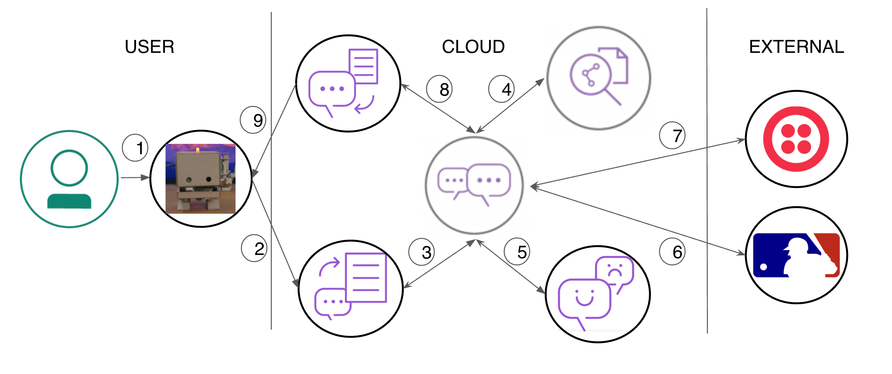
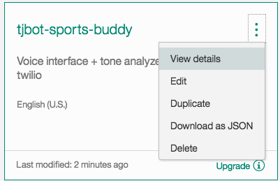
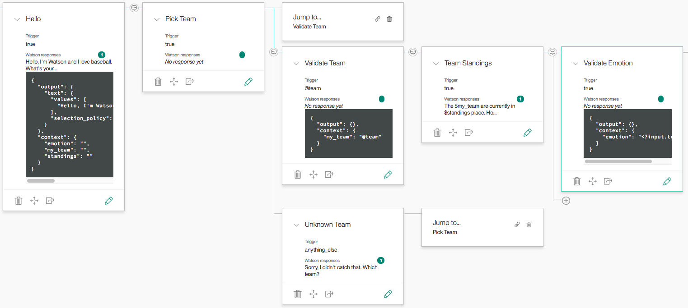
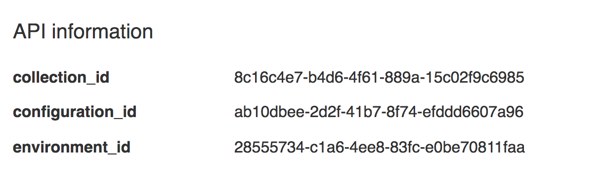
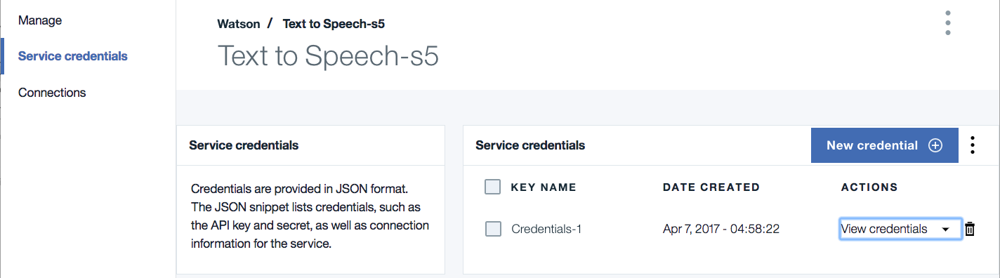
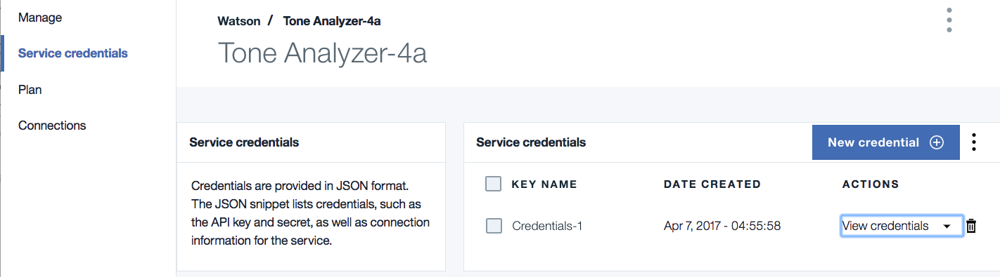

[](https://travis-ci.org/IBM/tjbot-sports-buddy)

# Build a TJBot using Watson Services to talk about sports

In this developer journey we will build a TJBot that knows baseball. Using 
Watson Discovery, TJBot will give you insight about your favorite teams, such as
their current league standing, their upcoming shedule, and links to a few
relevant articles from Watson News.

When the reader has completed this journey, they will understand how to:

* Build a TJBot that converses using Watson Conversation
* Use Watson Text to Speech and Speech to Text services to converse with TJBot
* Use Watson Tone Analyzer to determine your sentiment about your favorite teams
* Use Watson Discovery News to find news articles about your favorite teams 
* Query 3rd party data sources to get the latest Major League Baseball (MLB) data
* Use Twilio to send SMS text messages with team schedules and news article links



### With Watson

Want to take your Watson app to the next level? Looking to leverage Watson Brand assets? Join the [With Watson](https://www.ibm.com/watson/with-watson) program which provides exclusive brand, marketing, and tech resources to amplify and accelerate your Watson embedded commercial solution.

## Included Components
- Bluemix Watson Conversation
- Bluemix Watson Discovery
- Bluemix Watson Text to Speech
- Bluemix Watson Speech to Text
- Bluemix Watson Tone Analyzer
- Twilio 
- MLB Fantasy Data service
- Node

# Steps

This app is designed to be run on a TJBot, but it can work on any standard workstation
or laptop that supports audio controls - specifically a microphone input device and an 
output speaker. It may be simplier to first get this working on your laptop. If you 
would like to go directly to building this on a TJBot, jump to the section entitled
[Build a TJBot](#build-a-tjbot) before completing the following steps.

1. [Clone the repo](#1-clone-the-repo)
2. [Create Bluemix services](#2-create-bluemix-services)
3. [Configure Watson Conversation](#3-configure-watson-conversation)
4. [Enable Watson Discovery](#4-enable-watson-discovery)
5. [Enable Watson Speech to Text](#5-enable-watson-speech-to-text)
6. [Enable Watson Text to Speech](#6-enable-watson-text-to-speech)
7. [Enable Watson Tone Analyzer](#7-enable-watson-tone-analyzer)
8. [Register for Twilio Service](#8-register-for-twilio-service)
9. [Register for MLB Fantasy Data Service](#9-register-for-mlb-fantasy-data-service)
10. [Run the application](#10-run-the-application)

## 1. Clone the repo

Clone the `tjbot-sports-buddy` locally. In a terminal, run:

  `$ git clone https://github.com/ibm/tjbot-sports-buddy`

We’ll be using the file [`data/workspace.json`](data/workspace.json)

## 2. Create Bluemix services

Create the following services:

  * [**Watson Conversation**](https://console.ng.bluemix.net/catalog/services/conversation)
  * [**Watson Discovery**](https://console.ng.bluemix.net/catalog/services/discovery)
  * [**Watson Text to Speech**](https://console.ng.bluemix.net/catalog/services/text-to-speech/)
  * [**Watson Speech to Text**](https://console.ng.bluemix.net/catalog/services/speech-to-text/)
  * [**Watson Tone Analyzer**](https://console.ng.bluemix.net/catalog/services/tone-analyzer/)


## 3. Configure Watson Conversation

Launch the **Watson Conversation** tool. Use the **import** icon button on the right

<p align="center">
  
</p>

Find the local version of [`data/workspace.json`](data/workspace.json) and select
**Import**. Find the **Workspace ID** by clicking on the context menu of the new
workspace and select **View details**. Save this ID for later.

<p align="center">
  
</p>

*Optionally*, to view the conversation dialog select the workspace and choose the
**Dialog** tab, here's a snippet of the dialog:



## 4. Enable Watson Discovery

Launch the **Watson Discovery** tool. Select the **Watson Discovery News Collection**.

<p align="center">
  
</p>

From the details panel, save the **environment_id** and **collection_id** values.

<p align="center">
  
</p>

## 5. Enable Watson Speech to Text

Select the **Watson Speech to Text** service. Select the **Service credentials** menu item.


Click **View Credentials** and save the **username** and **password** values.

## 6. Enable Watson Text to Speech

Select the **Watson Text to Speech** service. Select the **Service credentials** menu item.



Click **View Credentials** and save the **username** and **password** values.

## 7. Enable Watson Tone Analyzer

Select the **Watson Tone Analyzer** service. Select the **Service credentials** menu item.



Click **View Credentials** and save the **username** and **password** values.

## 8. Register for Twilio Service

One of the main functions of the tjbot-sports-buddy is to text upcoming games and 
news headlines about the users favorite baseball teams. To send SMS text messages,
we use the Twilio service.

Register for a free trial account at [https://www.twilio.com/try-twilio](https://www.twilio.com/try-twilio).

As part of the service, you will be assigned the following values, which you will need to save:
- Account SID
- Authentication Token
- Twilio supplied phone number (where all texts will originate from)

By default, you will only be able to send SMS text messages to the phone number you
provided to create your account. To send messages to other numbers, you need to add
them at [https://www.twilio.com/console/phone_numbers/verified](https://www.twilio.com/console/phone_numbers/verified). 
For each number you enter, the user of the number will be asked to verify and then be 
sent a verification code. You will then need to enter this verification code to complete
the registration process. 

## 9. Register for MLB Fantasy Data Service

A big feature of the tjbot-sports-buddy is being able to provide up to the minute 
Major League Baseball (MLB) stats. Specifically, schedules and standings. To retrieve
this data, we use APIs supplied by FantasyData.

Register for a free trial accoount at [https://developer.fantasydata.com](https://developer.fantasydata.com).

Once registered, save the supplied subscription key.

## 10. Run the application

Copy the [`config.new.js`](config.new.js) to `config.js`, edit it with the necessary values
collected in the previous setup steps, and run the application.

```
$ cp config.new.js config.js
### edit config.js
$ node run.js
```

# Sample output

Textual version of a sample conversation with TJBot:

>**You:** "Hello Watson" 

>**TJBot:** "Hello. I'm Watson and I love baseball. Who's your favorite team?"

>**You:** "The Yankees"

>**TJBot:** "The New York Yankees are currently in first place. How do you think they will do this year?"

>**You:** "Great!"

>**TJBot:** "I agree, if they can stay healthy"

>**TJBot:** "Would you like me to text you the New York Yankees upcoming schedule and some headling links from Watson News?"

>**You:** "Sure"

>**TJBot:** "What number should I use?"

>**You:** "One two three four five six seven eight nine ten zero"

>**TJBot:** "Your text has been sent. Are you interested in any other teams?"

>**You:** "No thank you"

>**TJBot:** "OK. Have a nice day"

Here is a recap of the services used to perform this conversation:

- *Watson Conversation:* The conversation flow.
- *Watson Speech-To-Text:* Converts user input to text.
- *Watson Text-To-Speech:* Converts TJ Bot replies to sound.
- *Watson Tone Analyzer:* Determes an appropriate reply to the users sentiment about his favorite team.
- *Watson Discovery:* Generates headline links about the team.
- *Fantasy Data:* Retrieves the current standing and upcoming schedule for the team. 
- *Twilio:* Texts team schedule and news to the user.

## Build a TJBot

To build your TJBot, follow the tutorial entitled: 
[Build a Chatbot That Cares - Part2](https://medium.com/ibm-watson-developer-cloud/build-a-chatbot-that-cares-part-2-66367cf26e4b).

It provides a comprehensive guide for:

- Raspberry Pi setup
- TJBot Carboard assembly
- Node.js setup
- Audio support and trouble-shooting

Once your TJBot is running and functional, perform steps 1-10 above to setup and run the **TJBot Sports Buddy** app. 

# License

[Apache 2.0](LICENSE)
